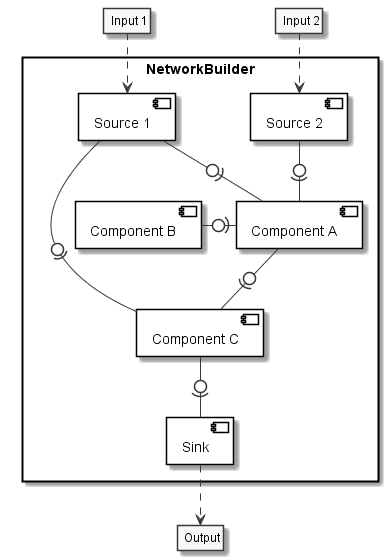
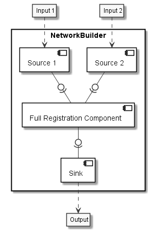
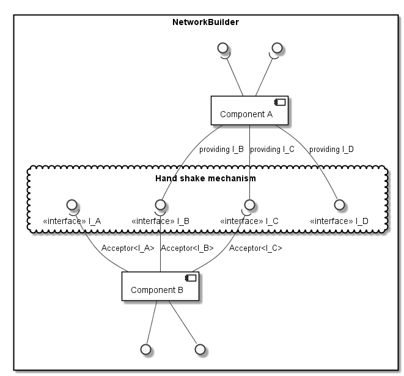

.. _Design:

Design
======

With SuperElastix we aim to capture a wide range of registration methods, accessible via a single high-level user interface.  At the core of our design is a single collection of components with heterogeneous levels of functionality and granularity. This means that a component can implement a single concept (metric, transform, etc.) to be reused in many methods, can implement multiple (tightly coupled) concepts in one, or even be a full registration algorithm. Breaking up algorithms in small components allows a user to mix-and-match component, whereas treating a larger part of algorithms as monolithic blocks lowers the barrier for integration of new methods and paradigms and reuse of existing codebases. By a high level user configuration, components are selected at run-time and are connected via a user-defined network layout. A generic handshake mechanism verifies whether connected components are compatible both mathematically as on a software level. The user is notified if specific combinations are incompatible or not supported (yet).

Network of components
---------------------

A classical approach for a registration toolbox is to use an object-oriented design that decomposes the registration problem into
classes like metrics, transforms, optimizers, etc. Extended types of behavior (mutual information, affine transform, etc) can be implemented via subtyping. Such a decomposition, however, might not be adequate to handle all of the diversity in existing registration paradigms. And, even within the same paradigm existing toolboxes have slighly different decomposions. Unification of registration methods by refactoring existing toolboxes into one object-oriented design is a tremendous amount of work, if possible at all. Additionally, an object-oriented design typically poses a rather rigid layout how e.g. an optimizer interacts with a metric and a tranforms. Within the large variety of paradigms, there seems to be little consensus to a standard organization. The design of SuperElastix, therefore, takes a different approach. A registration algorithm is considered to be a network of functional components. The network layout (i.e. amount of nodes and connections) is user configurable and the components (i.e. the nodes) are treated uniformely. In our framework each component formalizes its interfaces that determines whether components can connect. Components can have diverse functionalities such of mutual information, affine transform, or a full registration pipeline, but all have a generic mechanism to perform a handshake. 

    A user configurable network consisting of many connected Components.
    
.. ifconfig:: renderuml is 'True'
    
    .. uml::
        
       
        @startuml
          
          'style options 
          skinparam monochrome true
          skinparam circledCharacterRadius 0
          skinparam circledCharacterFontSize 0
          skinparam classAttributeIconSize 0
          hide empty members

          rectangle NetworkBuilder {
            component "Source 1" as Source1{
            }
            component "Source 2" as Source2{
            }
            component "Component A" as CompA {
            }
            component "Component B" as CompB {
            }
            component "Component C" as CompC {
            }
            component Sink {
            }

            Source1 -0)- CompA
            Source2 -0)- CompA
            CompB -right0)- CompA
            CompA -0)- CompC
            Source1 -0)- CompC
            CompC -0)- Sink
          }
          "Input 1" ..> Source1
          "Input 2" ..> Source2
          Sink ..> Output
        @enduml
        

    Components can fulfill many tasks upto a full registration pipeline.
        
.. ifconfig:: renderuml is 'True'
    
    .. uml::
    
        @startuml
          
          'style options 
          skinparam monochrome true
          skinparam circledCharacterRadius 0
          skinparam circledCharacterFontSize 0
          skinparam classAttributeIconSize 0
          hide empty members

          rectangle NetworkBuilder {
            component "Source 1" as Source1{
            }
            component "Source 2" as Source2{
            }
            component "Full Registration Component" as CompA {
            }
            component Sink {
            }

            Source1 -0)- CompA
            Source2 -0)- CompA
            CompA -0)- Sink
          }
          "Input 1" ..> Source1
          "Input 2" ..> Source2
          Sink ..> Output
        @enduml

Configuring the Network: Blueprints
----------------------------------

To configure an algorithmic network a Blueprint is passed to SuperElastix. 
A blueprint contains the description of a full network or is a partial configuration. Hence, multiple Blueprints can be passed to SuperElastix which together form a full configuration.
A full configuration defines a mathematical graph in terms of nodes: the ``Component``-s, and edges: the ``Connection``-s.
Properties can be put at both the ``Component``-s and the ``Connection``-s.
These properties are in the form of ``Key-Value`` pairs, where ``Keys`` and ``Values`` are strings or ``Values`` are lists of strings.
The minimal required property for a ``Component`` is ``"Name": <Identifier>``, with <Identifier> being any name in the form of a string. The minimal required properties for a ``Connection`` are ``"Out": <IdentifierA>`` and ``"In": <IdentifierB>``, with the Identifiers refering to the ``Components`` it connects.

.. code-block:: javascript
    :caption: Layout of a Blueprint json-file

    {
    "Component": {
        "Name": <Identifier>,
        <PropertyKey1> : <PropertyValue1>,
        ...
        <PropertyKeyN> : <PropertyValueN>
    }
    "Component": {
        ...
    }
    "Connection": {
        "Out": <IdentifierA>,
        "In": <IdentifierB>,
        <PropertyKeyM> : <PropertyValueM>,
        ...
    }
    "Connection": {
        ...
    }
    }

Additional properties for a ``Component`` can be: 

- Classname (e.g. ``"NameOfClass" : "itkGradientDescentOptimizerv4Component"``)
- A template parameter,  (e.g. ``"PixelType" : "double"``)
- Settings (e.g. ``"NumberOfLevels" : "3"`` or ``"SmoothingSigmasPerLevel" : ["8", "4", "2"]``)

Additional properties for a ``Connection`` can be: 

- Interface name (e.g. ``"NameOfInterface": "itkMetricv4Interface"``)
- template parameter (e.g. ``"Dimensionality" : "3"``)
- A tag (e.g. ``"Role" : "Fixed"``)

Given that the json file is valid and the blueprint meets the minimal required properties,
SuperElastix has a flexible mechanism to parse all additional properties and to realize the algorithmic network without unnescarilly requiring a verbose configuration file and aimed at having a user-extendible database of components.
Since initially each node in the graph can be any component in that is in SuperElastix its component database each property is considered an exclusion criterion.
Additionally, the properties defined at a connection form exclusion criteria for both components involved.
When all exclusion criteria are considered and for any node in the graph it cannnot be uniquely defined which component needs to be realized, SuperElastix will stop and report which component requires more or less criteria. 

The advantages of this mechanism are: 

- A user can select a component based on its connections (i.e. its role; what it can do) and doen't have to know the particular name of the class.
- By extending SuperElastix with new components that have identical connections to existing components it will automatically ask the user to provide additional (discriminating) properties.
- A user, for instance, does not need to specify "Dimensionality" : "3" for all components in the Blueprint if this can be deduced from one component in the network via its connections.
- A partially defined Blueprint can leave certain properties open, such that these can be defined by an other partially configuring blueprint that are passed to SuperElastix additially.

        
Generic handshake mechanism
---------------------------
        

    The handshake mechanism validates whether components can be connected or not.

.. ifconfig:: renderuml is 'True'
    
    .. uml::
    
        @startuml
          
          'style options 
          skinparam monochrome true
          skinparam circledCharacterRadius 0
          skinparam circledCharacterFontSize 0
          skinparam classAttributeIconSize 0
          hide empty members

		  rectangle NetworkBuilder {
          component "Component A" as CompA {
          }
        
          component "Component B" as CompB{
          }

            () " " as I_Before1
            () " " as I_Before2
		  
          cloud "Hand shake mechanism" {
            () "<<interface>> I_A" as I_A
            () "<<interface>> I_B" as I_B
            () "<<interface>> I_C" as I_C
			() "<<interface>> I_D" as I_D
          }

            () " " as I_After1
            () " " as I_After2

          
          I_Before1 )-down- CompA
          I_Before2 )-down- CompA
          CompA -down-() I_B : "providing I_B"
          CompA -down-() I_C : "providing I_C"
          CompA -down-() I_D : "providing I_D"
          I_A )-down- CompB : "Acceptor<I_A>"
          I_B )-down- CompB : "Acceptor<I_B>"
          I_C )-down- CompB : "Acceptor<I_C>"
          CompB -down-() I_After1
          CompB -down-() I_After2
		  
          }
        @enduml
        
Prior to running the registration algorithm contructed from a user-defined network, SuperElastix 
validates whether components can be connected or not. This hand mechanism
performs the necessary checks on what a component can do (as defined by its interfaces), which is
required to establish a connection. The advantage of explicitly
handling this generically and on a higher level, is that components
themselves do not need to perform these checks on neighboring
components, which would require a component to embed specific
knowledge about other components.

To manage all possible types of collaboration, SuperElastix maintains
an extensible collection of component interfaces. Any component in the toolbox must be defined
in terms of one or more interfaces, which are either
accepting or providing. After succesfull handshakes all components check
if sufficient accepting interfaces have been connected.
The underlying implementation details can be found in the development section.
