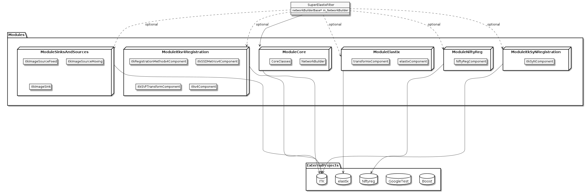

.. _Development:

Development
===============

SuperElastixFilter input and output datatypes
---------------------------------------------

The SuperElastixFilter is designed to be part of an itk pipeline such that it can connect to other itk filters and supports the itk update mechanism. All input and output data required by the (configured) algorithm are exposed by the SuperElastixFilter. In this philosophy the SuperElastixFilter does/should not read or write data (images, meshes, etc) from disk directly. Therefore, in the commandline tool, which uses the SuperElastixFilter, readers and writers reside outside the SuperElastixFilter.
However, unlike common itk filters, the inputs and outputs of the SuperElastixFilter are typically unknown at compile time, because they depend on the Blueprint configuration describing the actual algorithm to execute. This complicates the setup of a pipeline, since up and downstream itk filters are typically templated over their datatypes.
To stay as close as possible to the itk philosophy, the SuperElastixFilter supports 2 modes of operation:

- *Known input and output types at compilation time*: E.g. to connect the SuperElastixFilter to conventional ITK filters, which are templated on data types, or an application that embeds a dedicated registration task. That is, the application developer makes sure that any Blueprints to be used, will correspond to the (compile-time defined) number and types of inputs and outputs by known identifier names (defined by the Sink and Source Components). In this mode, the order in which the inputs and outputs are connected to other filters, and the Blueprint (Object) is set, is arbitrary. However, to connect the output of the SuperElastixFilter a templated version of GetOutput must be used: :code:`ImageFileWriter<KnownImageType>::Pointer my_writer;` :code:`...` :code:`my_writer->SetInput(superElastixFilter->GetOutput<KnownImageType>(identifier))`. 
  An example snippet:
   
.. code-block:: c++
   :caption: Example usage if input and output types are known at compilation time
   :name: SuperElastixKnownIO

    // Set up the ITK reader
    using InputImageType = itk::Image<float,3>;
    using ImageReaderType = itk::ImageFileReader<InputImageType>;
    ImageReaderType::Pointer reader = ImageReaderType::New();
    reader->SetFileName( path );

    // Set up the ITK writer
    using OutputImageType = itk::Image<double,3>;
    using ImageWriterType = itk::ImageFileWriter<OutputImageType>;
    ImageWriterType::Pointer writer = ImageWriterType::New();
    writer->SetFileName( path );
    
    // Connect the ITK pipeline (in arbitary order)
    // Assume superElastixFilter was instantiated.
    superElastixFilter->SetInput( "FixedImage", reader->GetOutput());
    // The output of superElastixFilter needs to be made of OutputImageType explicitly.
    writer->SetInput(superElastixFilter->GetOutput<OutputImageType>( "ResultImage" ));
    // Assume blueprint was instantiated. It is requered that the blueprint defines the a source 
    // component the named "FixedImage" that corresponds to the InputImageType. This holds 
    // for the sink component "ResultImage" and OutputImageType. 
    superElastixFilter->SetBlueprint(blueprint);
    
    // Updating the writer makes the superElastixFilter first parse the blueprint and the 
    // connection before it executes.
    writer->Update();

- *Unknown input and output types at compilation time*: E.g. the class implementing the commandline interface is not aware of the datatypes used by all components. (In this way, adding custom components with new types does not affect the source code of the commandline interface). The commandline interface is invoked by pairs of filenames and identifier names. The identifiers refer to Sink or Source Components as defined via the Blueprint that, in turn, define the data types. In this mode, the commandline interface typically cannot instantiate readers or writers because they are templated over the data types. Instead, the SuperElastixFilter is requested to return appropriate readers and writers corresponding to the identifier names. SuperElastix will return respectively an AnyReader or AnyWriter, which are non-templated Base Classes that, if updated, use the appropriate reader of writer internally (by use of polymorphism): :code:`AnyWriter::Pointer my_writer;` :code:`...` :code:`my_writer->SetInput(superElastixFilter->GetOutput(identifier))`. In this mode, it is required to set the Blueprint prior to request and connect readers or writers. 
  An example snippet:

.. code-block:: c++
   :caption: Example usage if input and output types are unknown at compilation time
   :name: SuperElastixUnknownIO

    // Assume superElastixFilter and blueprint were instantiated.
    // Set Blueprint first, which defines a source component called "FixedImage" and a sink 
    // component called "ResultImage".
    superElastixFilter->SetBlueprint(blueprint);
    
    // Get AnyReader for "FixedImage", this triggers the parsing of the Blueprint.
    selx::AnyFileReader::Pointer reader = superElastixFilter->GetInputFileReader( "FixedImage" );
    reader->SetFileName( path );

    // Get AnyWriter for "ResultImage"
    selx::AnyFileWriter::Pointer writer = superElastixFilter->GetOutputFileWriter( "ResultImage" );
    writer->SetFileName( path );
    
    // Connect the ITK pipeline
    superElastixFilter->SetInput( "FixedImage", reader->GetOutput() );
    writer->SetInput( superElastixFilter->GetOutput( "ResultImage" ) );

    // Updating the writer makes the superElastixFilter to execute.
    writer->Update();

Mixing these to modes of operation is allowed too.

SuperElastixFilter component database manipulation
--------------------------------------------------

We provide two library interfaces, each supporting a different use case:

- *"Precompiled" SuperElastix ITK filter*, designed to be used in external applications, such as the commandline interface or company applications.
 
- *"Templated" SuperElastix ITK filter*, offering the most flexibility, useful for external third-party components and extreme use cases.

In both cases SuperElastixFilter has an internal database of components that can be used to dynamically construct the registration algorithm of choice.
In the "Precompiled" library this database is populated with a predefined list of components (each with predefined template arguments, such as dimensionality and pixel type, etc). Predefinition of the components allows for hiding the implementation details of the components and speeds up the compilation process of the application (done via the Pimpl idiom). The "Precompiled" library is still and ITK filter and depends on the (templated) header files of the itk library. The superElastixFilter is instantiated like this:

.. code-block:: c++
   :caption: Example usage of "Precompiled" SuperElastix ITK filter
   :name: SuperElastixFilterPrecompiled
  
   #include "selxSuperElastixFilter.h"
   selx::SuperElastixFilter::Pointer superElastixFilter = selx::SuperElastixFilter::New();

In the "Templated" library the database of components can be populated by the user at compilation time by passing the component classes as template arguments. Applications using this library need access to all of SuperElastix internal source and header files at compilation time. This approach provides the flexibility to compile an instance of the SuperElastix ITK filter with, for instance, a sub- or superset of the default components, a set of components with exotic dimensionality or pixel types or even with third party components. Compiling the SuperElastix ITK filter with a small set of components is typically done in our Unit tests when testing a specific component or combination of components. Adding a third-party component to SuperElastix via template arguments does not require any modification of the source code files of the SuperElastixFilter. A third-party component can adhere to the existing already defined interfaces classes, but op top of that it can also define new interface classes. For example, the templated superElastixFilter is instantiated like this:

.. code-block:: c++
  :caption: Example usage of "Templated" SuperElastix ITK filter
  :name: SuperElastixFilterTemplated

  #include "selxSuperElastixFilterCustomComponents.h"
  // ... and #include all headers of the components used
  
  /** Construct a list with user required components */
  using RegisterComponents =  TypeList< 
    ItkImageSourceComponent< 2, float >,
    DisplacementFieldItkImageFilterSinkComponent< 2, float >,
    ItkImageRegistrationMethodv4Component< 3, double, double >,
    ItkImageRegistrationMethodv4Component< 2, float, double >,
    ItkANTSNeighborhoodCorrelationImageToImageMetricv4Component< 2, float >,
    ItkMeanSquaresImageToImageMetricv4Component< 2, float, double  >,
    ItkGradientDescentOptimizerv4Component< double >,
    ItkAffineTransformComponent< double, 2 >,
    ItkTransformDisplacementFilterComponent< 2, float, double >,
    RegistrationControllerComponent< >
    >;

  SuperElastixFilterBase::Pointer superElastixFilter = 
    SuperElastixFilterCustomComponents< RegisterComponents >::New();

.. figure:: rendered/plantuml-1fc5bd95c100b65682bf7bef861a91018e46c238.png
      
      UML use case diagram for "Templated" and "Precompiled" library

      
.. ifconfig:: renderuml is 'True'
    
    .. uml::
    
      @startuml
      
      allow_mixing
      
      'style options 
      skinparam monochrome true
      skinparam circledCharacterRadius 0
      skinparam circledCharacterFontSize 0
      skinparam classAttributeIconSize 0
      hide empty members
      
      class SuperElastixFilterCustomComponents< "<CompontentA<> ... CompontentZ<>>" > {
        networkBuilderBase* m_NetworkBuilder = networkBuilder< CompontentA<>, ... , CompontentZ<> >
      }
      
      class SuperElastixFilterBase {
        "All ItkFilterMethods"
      }
      
      class SuperElastixFilter {
        networkBuilderBase* m_NetworkBuilder = networkBuilder< DefaultComponentList ...  >
      }          
      
      usecase (Application that embeds\nSuperElastix with\ndefault functionality) as DefaultApplication
      usecase (The SuperElastix\ncommandline\napplication) as CommandlineApplication
      usecase (Component\nunit tests) as UnitTest
      usecase (Third-party\nComponent\ndevelopment) as ThirdPartyComponentDevelopment
      
      SuperElastixFilterCustomComponents --|> SuperElastixFilterBase
      SuperElastixFilterCustomComponents -down-o UnitTest
      SuperElastixFilterCustomComponents -down-o ThirdPartyComponentDevelopment
      SuperElastixFilter --|> SuperElastixFilterBase
      SuperElastixFilter -down-o CommandlineApplication
      SuperElastixFilter -down-o DefaultApplication
      @enduml
          
User Component Creation
-----------------------

A SuperElastix Component consists of accepting and providing interfaces. To let the handshake mechanism handle a component correctly the component (class) must adhere to the following structure. The component class must derive from the :code:`SuperElastixComponent` class (solely). The :code:`SuperElastixComponent` is a templated class with signature :code:`< <Providing<I_A, I_B, ... >, Accepting<I_C, I_D, ... > > >`, with classes :code:`Providing` and :code:`Accepting` acting as placeholders to indicate the role of the interfaces :code:`I`.
By inheriting from the :code:`SuperElastixComponent` class the component developer needs to provide the implementation for a number of methods. These are:

- All methods that have been defined in the providing interface classes that component developer selected. 

- A :code:`virtual void Accept(I_x*)` for each interface class :code:`I_x` that has been selected as accepting interface. (This example uses raw pointes, but in the reality we use code:`std::shared_ptr` for this).

- The :code:`virtual bool MeetsCriterion( const CriterionType & criterion )`, which returns true if and only if the component has an implementation for which the criterion (read from the Blueprint) holds or can be fulfilled.

.. figure:: rendered/plantuml-09ce2fd7f79d1feb48d70b21c89a4c9a9f686445.png

    UML class inheritance diagram of a Component in SuperElastix

    
.. ifconfig:: renderuml is 'True'
    
    .. uml::
       
          @startuml
          
          'style options 
          skinparam monochrome true
          skinparam circledCharacterRadius 0
          skinparam circledCharacterFontSize 0
          skinparam classAttributeIconSize 0
          hide empty members
          
          class CustomComponent{
          type_A Method_A(args)
          type_B Method_B(args)
          void Accept(I_C*)
          void Accept(I_D*)
          bool MeetsCriterion()
          }
          
          class SuperElastixComponent< "<Providing<I_A, I_B, ... >, Accepting<I_C, I_D, ... > >" > {
          "HandShakeMethods"()
          }
    
          package Providing {
          class I_A << interface >> {
          type_A Method_A(args)
          }
          class I_B << interface >> {
          type_B Method_B(args)
          }
          }
          
          package Accepting {     
          class "Acceptor<I_C>" << interface >> {
          void Accept(I_C*)
          }
          
          class "Acceptor<I_D>" << interface >> {
          void Accept(I_D*)
          }
          }
          
          class ComponentBase {
          bool MeetsCriterion()
          "HandShakeMethods"()
          }
          
          ComponentBase <|-- SuperElastixComponent
          I_A <|-- SuperElastixComponent
          I_B <|-- SuperElastixComponent
          "Acceptor<I_C>" <|-- SuperElastixComponent
          "Acceptor<I_D>" <|-- SuperElastixComponent
          
          SuperElastixComponent <|-- CustomComponent 
          @enduml
          
    
.. code-block:: c++
    :caption: Layout of an example component of SuperElastix
    :name: SuperElastixComponentLayout

    // Required include guards
    #ifndef selxExampleComponent_h
    #define selxExampleComponent_h
    
    // Required include of selxSuperElastixComponent
    #include "selxSuperElastixComponent.h"

    // Optionally include other interface definitions
    // #include "selxSinksAndSourcesInterfaces.h"

    // Optionally include your code base specific headers.
    // ...
    
    namespace selx
    {
    // Choose your own template arguments for the component
    template< int Dimensionality, class PixelType, class TInternalComputationValue > 
    class ExampleComponent :
      public SuperElastixComponent<
        // define any number of Accepting interfaces
        Accepting< 
          ExampleAInterface< Dimensionality >,
          ExampleBInterface< TInternalComputationValue, Dimensionality >
        >,
        // define any number of Providing interfaces
        Providing< 
          ExampleCInterface< Dimensionality, PixelType >
        >
      >
    {
    
    public:
    
      // Important: the definition of Superclass must match the definition above.
      using Superclass = SuperElastixComponent<
        Accepting< ExampleAInterface< Dimensionality >,
        ExampleBInterface< TInternalComputationValue, Dimensionality >
        >,
        Providing< ExampleCInterface< Dimensionality, PixelType >
        >
      >;

      // A constructor with arguments for name and logger is required.
      ExampleComponent( const std::string & name, LoggerImpl & logger );
      
      virtual ~ExampleComponent();

      //For each Accepting Interface a Accept method must be implemented:
	  // Accepting ExampleAInterface
      virtual int Accept( typename ExampleAInterface< Dimensionality >::Pointer ) override;
	  
	  // Accepting ExampleBInterface
      virtual int Accept( typename ExampleBInterface< TInternalComputationValue, Dimensionality >::Pointer ) override;

      // All methods in all Providing Interfaces must be implemented:
	  // Providing ExampleCInterface
      virtual SomeImageType<PixelType, Dimensionality>* GetImage() override;

      //BaseClass methods
      virtual bool MeetsCriterion( const ComponentBase::CriterionType & criterion ) override;

	  // Optional: The default implementation, which requires all Accepting interfaces to be connected, can be overridden
	  // virtual bool ConnectionsSatisfied() override;
	  
    private:

      // Typically a component stores the pointer to the Interfaces it accepts by Accept(), however 
      // this is not required.
      typename ExampleAInterface< Dimensionality >::Pointer m_ExampleAInterface;
      
      // Optionally include your own methods and members
      // ...
      
    protected:

      // Optional, but recommended: TemplateProperties() is typically used in MeetsCriterion()
      // return the class name and the template arguments to uniquely identify this component.
      static inline const std::map< std::string, std::string > TemplateProperties()
      {
      return { { keys::NameOfClass, "ExampleComponent" }, 
               { keys::PixelType, PodString< PixelType >::Get() }, 
               { keys::InternalComputationValueType, PodString< TInternalComputationValue >::Get() }, 
               { keys::Dimensionality, std::to_string( Dimensionality ) } 
             };
      }
    };
    } //end namespace selx
    #ifndef ITK_MANUAL_INSTANTIATION
    #include "selxExampleComponent.hxx"
    #endif
    #endif // #define ExampleComponent_h

.. code-block:: c++
    :caption: Interface definitions of an example component of SuperElastix
    :name: SuperElastixComponentInterfaces

    // And interface class is pure virtual, thus no methods have an implementation at this stage
    template< int Dimensionality >
    class ExampleAInterface
    {
    public:
      // Some convenience typedefs
      using Type = ExampleAInterface< Dimensionality>;
      using Pointer = std::shared_ptr< Type >;
      
      // Define 1 or more methods, with any type of input and output arguments.
      virtual int MethodA1() = 0;
      // virtual bool MethodA2( TInternalComputationValueType value) = 0;
    };

    template< class TInternalComputationValueType, int Dimensionality >
    class ExampleBInterface
    {
      // ...
    };
    
    template< class PixelType, int Dimensionality >
    class ExampleCInterface
    {
      using Type = ExampleCInterface< PixelType, Dimensionality>;
      using Pointer = std::shared_ptr< Type >;
      virtual SomeImageType<PixelType, Dimensionality>* GetImage( ) = 0;
    };

    // ...
    
    template< class PixelType, int Dimensionality >
    struct Properties< ExampleCInterface< PixelType, Dimensionality >>
    {
      static const std::map< std::string, std::string > Get()
      {
        // return all the properties how to identify this interface as strings
        return { { keys::NameOfInterface, "ExampleCInterface" }, // required: class name
          { keys::PixelType, PodString< PixelType >::Get() }, // required: all template arguments
          { keys::Dimensionality, std::to_string( Dimensionality ) }, 
          { "Role", "Fixed" } // optional: more descriptive properties to select this interface
        };
      }
    };
    
Cmake module selection system
-----------------------------

The modules can specify on which of the other modules they depend, and the build system make sure dependencies are enabled, and that they are enabled in the correct order. This means that users are always building the smallest possible binary, reducing binary size and compilation time. The following output shows the result of the default build, which builds the library interface along with elastix, nifityreg and the ITKv4 registration methods. 

::

  -- Found the following SuperElastix modules:
  --   ModuleBlueprints
  --   ModuleCommon
  --   ModuleComponentInterface
  --   ModuleController
  --   ModuleElastix
  --   ModuleExamples
  --   ModuleItkSmoothingRecursiveGaussianImageFilter
  --   ModuleNiftyreg
  --   ModuleSinksAndSources
  --   ModuleItkImageRegistrationMethodv4
  --   ModuleItkSyNImageRegistrationMethod
  --   ModuleConfigurationReader
  --   ModuleFileIO
  --   ModuleFilter
  --   ModuleLogger
  -- Enabling ModuleFilter requested by SuperElastix.
  -- Enabling ModuleBlueprints requested by ModuleFilter.
  -- ModuleBlueprints enabled.
  -- Enabling ModuleController requested by ModuleFilter.
  -- ModuleController enabled.
  -- Enabling ModuleElastix requested by ModuleFilter.
  -- ModuleElastix enabled.
  -- Enabling ModuleExamples requested by ModuleFilter.
  -- Enabling ModuleComponentInterface requested by ModuleExamples.
  -- Enabling ModuleCommon requested by ModuleComponentInterface.
  -- ModuleCommon enabled.
  -- Enabling ModuleFileIO requested by ModuleComponentInterface.
  -- ModuleFileIO enabled.
  -- ModuleComponentInterface enabled.
  -- ModuleExamples enabled.
  -- Enabling ModuleItkImageRegistrationMethodv4 requested by ModuleFilter.
  -- ModuleItkImageRegistrationMethodv4 enabled.
  -- Enabling ModuleItkSmoothingRecursiveGaussianImageFilter requested by ModuleFilter.
  -- ModuleItkSmoothingRecursiveGaussianImageFilter enabled.
  -- Enabling ModuleSinksAndSources requested by ModuleFilter.
  -- Enabling ModuleController requested by ModuleSinksAndSources.
  -- ModuleController already enabled.
  -- ModuleSinksAndSources enabled.
  -- Enabling ModuleNiftyreg requested by ModuleFilter. 

Modules are enabled once, even when requested multiple times, and can be turned off and on via CMake.

To add a module to SuperElastix, the developer creates a new directory and a CMake file that honor some naming conventions. The name of CMake file should Module[Name].cmake where [Name] is the name of the module. The CMake file contains a collection of CMake variables that the build system will use to integrate the module as component in the SuperElastixFilter. Users will never have to touch code outside module directory.

    Modules, Components and external projects

    
.. ifconfig:: renderuml is 'True'
    
    .. uml::
    
          @startuml
          
          'style options 
          skinparam monochrome true
          skinparam circledCharacterRadius 0
          skinparam circledCharacterFontSize 0
          skinparam classAttributeIconSize 0
          hide empty members
                   
          class SuperElastixFilter {
          networkBuilderBase* m_NetworkBuilder
          }

          package Modules {
          
             package ModuleCore <<Node>> {
               class NetworkBuilder {
               }
               class "CoreClasses" {
               }
             }
             package ModuleSinksAndSources <<Node>> {
               class itkImageSourceFixed {
               }
               class itkImageSourceMoving {
               }
               class itkImageSink {
               }
             }
             package ModuleElastix <<Node>> {
             class elastixComponent{
             }
             class transformixComponent{
             }
             
             }
             package ModuleItkv4Registration <<Node>> {
               class itkRegistrationMethodv4Component
               class itkSSDMetricv4Component
               class itkSVFTransformComponent
               class "itkv4Component"
             }
             package ModuleNiftyReg <<Node>> {
               class "NiftyRegComponent" {
               }            
             }
             package ModuleItkSyNRegistration <<Node>> {
                class "itkSyNComponent"            
             }
             
          }
          
          SuperElastixFilter --> ModuleCore
          SuperElastixFilter ..> ModuleElastix : optional
          SuperElastixFilter ..> ModuleSinksAndSources : optional
          SuperElastixFilter ..> ModuleItkv4Registration : optional
          SuperElastixFilter ..> ModuleNiftyReg : optional
          SuperElastixFilter ..> ModuleItkSyNRegistration : optional
          
          package ExternalProjects {
          
            package Boost <<DataBase>> {
            
            }
            
            package GoogleTest <<DataBase>> {
            
            }
            
            package ITK <<DataBase>> {
            
            }
            
            package elastix <<DataBase>> {
            
            }
            
            package Niftyreg <<DataBase>> {
            
            }
            
          }
          Modules ---[hidden]down---> ExternalProjects
          
          
          ModuleCore ---down--> ITK
          ModuleSinksAndSources ---down---> ITK
          ModuleElastix ---down---> elastix
          ModuleItkv4Registration ---down---> ITK
          ModuleNiftyReg ---down---> Niftyreg
          ModuleItkSyNRegistration ---down---> ITK
          
        
        @enduml
