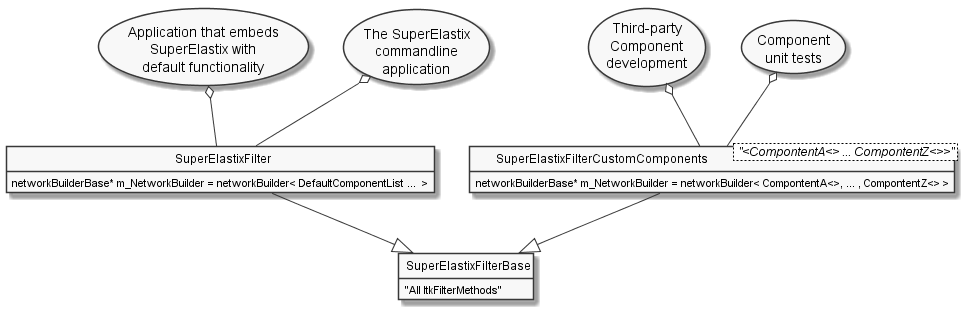

.. _LibraryUsage:

Library Usage
=============

SuperElastixFilter input and output datatypes
---------------------------------------------

The SuperElastixFilter is designed to be part of an itk pipeline such that it can connect to other itk filters and supports the itk update mechanism. All input and output data required by the (configured) algorithm are exposed by the SuperElastixFilter. In this philosophy the SuperElastixFilter does/should not read or write data (images, meshes, etc) from disk directly. Therefore, in the commandline tool, which uses the SuperElastixFilter, readers and writers reside outside the SuperElastixFilter.
However, unlike common itk filters, the inputs and outputs of the SuperElastixFilter are typically unknown at compile time, because they depend on the Blueprint configuration describing the actual algorithm to execute. This complicates the setup of a pipeline, since up and downstream itk filters are typically templated over their datatypes.
To stay as close as possible to the itk philosophy, the SuperElastixFilter supports 2 modes of operation:

- *Known input and output types at compilation time*: E.g. to connect the SuperElastixFilter to conventional ITK filters, which are templated on data types, or an application that embeds a dedicated registration task. That is, the application developer makes sure that any Blueprints to be used, will correspond to the (compile-time defined) number and types of inputs and outputs by known identifier names (defined by the Sink and Source Components). In this mode, the order in which the inputs and outputs are connected to other filters, and the Blueprint (Object) is set, is arbitrary. However, to connect the output of the SuperElastixFilter a templated version of GetOutput must be used: :code:`ImageFileWriter<KnownImageType>::Pointer my_writer;` :code:`...` :code:`my_writer->SetInput(superElastixFilter->GetOutput<KnownImageType>(identifier))`. 
  An example snippet:
   
.. code-block:: c++
   :caption: Example usage if input and output types are known at compilation time
   :name: SuperElastixKnownIO

    // Set up the ITK reader
    using InputImageType = itk::Image<float,3>;
    using ImageReaderType = itk::ImageFileReader<InputImageType>;
    ImageReaderType::Pointer reader = ImageReaderType::New();
    reader->SetFileName( path );

    // Set up the ITK writer
    using OutputImageType = itk::Image<double,3>;
    using ImageWriterType = itk::ImageFileWriter<OutputImageType>;
    ImageWriterType::Pointer writer = ImageWriterType::New();
    writer->SetFileName( path );
    
    // Connect the ITK pipeline (in arbitary order)
    // Assume superElastixFilter was instantiated.
    superElastixFilter->SetInput( "FixedImage", reader->GetOutput());
    // The output of superElastixFilter needs to be made of OutputImageType explicitly.
    writer->SetInput(superElastixFilter->GetOutput<OutputImageType>( "ResultImage" ));
    // Assume blueprint was instantiated. It is requered that the blueprint defines the a source 
    // component the named "FixedImage" that corresponds to the InputImageType. This holds 
    // for the sink component "ResultImage" and OutputImageType. 
    superElastixFilter->SetBlueprint(blueprint);
    
    // Updating the writer makes the superElastixFilter first parse the blueprint and the 
    // connection before it executes.
    writer->Update();

- *Unknown input and output types at compilation time*: E.g. the class implementing the commandline interface is not aware of the datatypes used by all components. (In this way, adding custom components with new types does not affect the source code of the commandline interface). The commandline interface is invoked by pairs of filenames and identifier names. The identifiers refer to Sink or Source Components as defined via the Blueprint that, in turn, define the data types. In this mode, the commandline interface typically cannot instantiate readers or writers because they are templated over the data types. Instead, the SuperElastixFilter is requested to return appropriate readers and writers corresponding to the identifier names. SuperElastix will return respectively an AnyReader or AnyWriter, which are non-templated Base Classes that, if updated, use the appropriate reader of writer internally (by use of polymorphism): :code:`AnyWriter::Pointer my_writer;` :code:`...` :code:`my_writer->SetInput(superElastixFilter->GetOutput(identifier))`. In this mode, it is required to set the Blueprint prior to request and connect readers or writers. 
  An example snippet:

.. code-block:: c++
   :caption: Example usage if input and output types are unknown at compilation time
   :name: SuperElastixUnknownIO

    // Assume superElastixFilter and blueprint were instantiated.
    // Set Blueprint first, which defines a source component called "FixedImage" and a sink 
    // component called "ResultImage".
    superElastixFilter->SetBlueprint(blueprint);
    
    // Get AnyReader for "FixedImage", this triggers the parsing of the Blueprint.
    selx::AnyFileReader::Pointer reader = superElastixFilter->GetInputFileReader( "FixedImage" );
    reader->SetFileName( path );

    // Get AnyWriter for "ResultImage"
    selx::AnyFileWriter::Pointer writer = superElastixFilter->GetOutputFileWriter( "ResultImage" );
    writer->SetFileName( path );
    
    // Connect the ITK pipeline
    superElastixFilter->SetInput( "FixedImage", reader->GetOutput() );
    writer->SetInput( superElastixFilter->GetOutput( "ResultImage" ) );

    // Updating the writer makes the superElastixFilter to execute.
    writer->Update();

Mixing these to modes of operation is allowed too.

SuperElastixFilter component database manipulation
--------------------------------------------------

We provide two library interfaces, each supporting a different use case:

- *"Precompiled" SuperElastix ITK filter*, designed to be used in external applications, such as the commandline interface or company applications.
 
- *"Templated" SuperElastix ITK filter*, offering the most flexibility, useful for external third-party components and extreme use cases.

In both cases SuperElastixFilter has an internal database of components that can be used to dynamically construct the registration algorithm of choice.
In the "Precompiled" library this database is populated with a predefined list of components (each with predefined template arguments, such as dimensionality and pixel type, etc). Predefinition of the components allows for hiding the implementation details of the components and speeds up the compilation process of the application (done via the Pimpl idiom). The "Precompiled" library is still and ITK filter and depends on the (templated) header files of the itk library. The superElastixFilter is instantiated like this:

.. code-block:: c++
   :caption: Example usage of "Precompiled" SuperElastix ITK filter
   :name: SuperElastixFilterPrecompiled
  
   #include "selxSuperElastixFilter.h"
   selx::SuperElastixFilter::Pointer superElastixFilter = selx::SuperElastixFilter::New();

In the "Templated" library the database of components can be populated by the user at compilation time by passing the component classes as template arguments. Applications using this library need access to all of SuperElastix internal source and header files at compilation time. This approach provides the flexibility to compile an instance of the SuperElastix ITK filter with, for instance, a sub- or superset of the default components, a set of components with exotic dimensionality or pixel types or even with third party components. Compiling the SuperElastix ITK filter with a small set of components is typically done in our Unit tests when testing a specific component or combination of components. Adding a third-party component to SuperElastix via template arguments does not require any modification of the source code files of the SuperElastixFilter. A third-party component can adhere to the existing already defined interfaces classes, but op top of that it can also define new interface classes. For example, the templated superElastixFilter is instantiated like this:

.. code-block:: c++
  :caption: Example usage of "Templated" SuperElastix ITK filter
  :name: SuperElastixFilterTemplated

  #include "selxSuperElastixFilterCustomComponents.h"
  // ... and #include all headers of the components used
  
  /** Construct a list with user required components */
  using RegisterComponents =  TypeList< 
    ItkImageSourceComponent< 2, float >,
    DisplacementFieldItkImageFilterSinkComponent< 2, float >,
    ItkImageRegistrationMethodv4Component< 3, double, double >,
    ItkImageRegistrationMethodv4Component< 2, float, double >,
    ItkANTSNeighborhoodCorrelationImageToImageMetricv4Component< 2, float >,
    ItkMeanSquaresImageToImageMetricv4Component< 2, float, double  >,
    ItkGradientDescentOptimizerv4Component< double >,
    ItkAffineTransformComponent< double, 2 >,
    ItkTransformDisplacementFilterComponent< 2, float, double >,
    RegistrationControllerComponent< >
    >;

  SuperElastixFilterBase::Pointer superElastixFilter = 
    SuperElastixFilterCustomComponents< RegisterComponents >::New();

      
      UML use case diagram for "Templated" and "Precompiled" library

      
.. ifconfig:: renderuml is 'True'
    
    .. uml::
    
      @startuml
      
      allow_mixing
      
      'style options 
      skinparam monochrome true
      skinparam circledCharacterRadius 0
      skinparam circledCharacterFontSize 0
      skinparam classAttributeIconSize 0
      hide empty members
      
      class SuperElastixFilterCustomComponents< "<CompontentA<> ... CompontentZ<>>" > {
        networkBuilderBase* m_NetworkBuilder = networkBuilder< CompontentA<>, ... , CompontentZ<> >
      }
      
      class SuperElastixFilterBase {
        "All ItkFilterMethods"
      }
      
      class SuperElastixFilter {
        networkBuilderBase* m_NetworkBuilder = networkBuilder< DefaultComponentList ...  >
      }          
      
      usecase (Application that embeds\nSuperElastix with\ndefault functionality) as DefaultApplication
      usecase (The SuperElastix\ncommandline\napplication) as CommandlineApplication
      usecase (Component\nunit tests) as UnitTest
      usecase (Third-party\nComponent\ndevelopment) as ThirdPartyComponentDevelopment
      
      SuperElastixFilterCustomComponents --|> SuperElastixFilterBase
      SuperElastixFilterCustomComponents -down-o UnitTest
      SuperElastixFilterCustomComponents -down-o ThirdPartyComponentDevelopment
      SuperElastixFilter --|> SuperElastixFilterBase
      SuperElastixFilter -down-o CommandlineApplication
      SuperElastixFilter -down-o DefaultApplication
      @enduml
