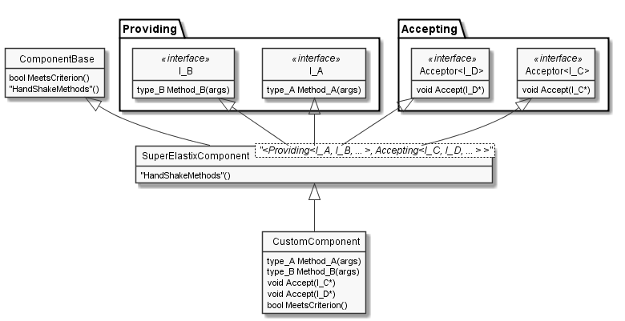
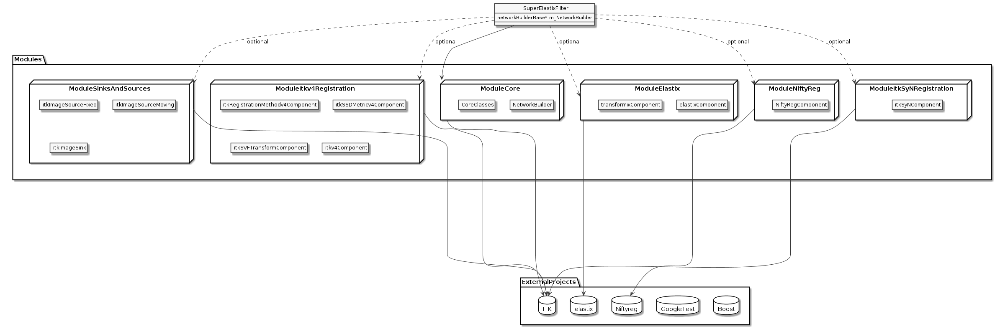

.. _UserComponentCreation:
          
User Component Creation
=======================

This is a quick overview how to add you own registration components to SuperElastix.

Test if you can build SuperElastix locally:

- git clone github.com/SuperElastix/SuperElastix (to contribute consider `forking <https://guides.github.com/activities/forking/>`_ first)
- use cmake with our SuperBuild to get and build all external dependencies automatically, see :ref:`GettingStarted`.

To create a new component:

- The build process of SuperElastix `automatically scans <ModuleSelectionSystem_>`_ its :code:`Modules/Components/` directory for the source files of components.
- Create a Component group directory :code:`Modules/Components/<MyComponentGroup>`. A registration method can be composed of multiple components that can be grouped.
- Tip: copy one of the other Component Groups and change the names.

The minimal required directory structures should be as following:

::

 Modules/Components/<MyComponentGroup>/Module<MyComponentGroup>.cmake
 Modules/Components/<MyComponentGroup>/include/selxModule<MyComponentGroup>.h

- The :code:`Module<MyComponentGroup>.cmake` file lists all components source files and :code:`selxModule<MyComponentGroup>.h` file lists which components (with various template arguments) are compiled into SuperElastix.

 
SuperElastixComponent class
---------------------------
 
A SuperElastix Component consists of accepting and providing interfaces. To let the handshake mechanism handle a component correctly the component (class) must adhere to the following structure. The component class must derive from the :code:`SuperElastixComponent` class (solely). The :code:`SuperElastixComponent` is a templated class with signature :code:`< <Providing<I_A, I_B, ... >, Accepting<I_C, I_D, ... > > >`, with classes :code:`Providing` and :code:`Accepting` acting as placeholders to indicate the role of the interfaces :code:`I`.
By inheriting from the :code:`SuperElastixComponent` class the component developer needs to provide the implementation for a number of methods. These are:

- All methods that have been defined in the providing interface classes that component developer selected. 

- A :code:`virtual void Accept(I_x*)` for each interface class :code:`I_x` that has been selected as accepting interface. (This example uses raw pointes, but in the reality we use code:`std::shared_ptr` for this).

- The :code:`virtual bool MeetsCriterion( const CriterionType & criterion )`, which returns true if and only if the component has an implementation for which the criterion (read from the Blueprint) holds or can be fulfilled.

    UML class inheritance diagram of a Component in SuperElastix

    
.. ifconfig:: renderuml is 'True'
    
    .. uml::
       
          @startuml
          
          'style options 
          skinparam monochrome true
          skinparam circledCharacterRadius 0
          skinparam circledCharacterFontSize 0
          skinparam classAttributeIconSize 0
          hide empty members
          
          class CustomComponent{
          type_A Method_A(args)
          type_B Method_B(args)
          void Accept(I_C*)
          void Accept(I_D*)
          bool MeetsCriterion()
          }
          
          class SuperElastixComponent< "<Providing<I_A, I_B, ... >, Accepting<I_C, I_D, ... > >" > {
          "HandShakeMethods"()
          }
    
          package Providing {
          class I_A << interface >> {
          type_A Method_A(args)
          }
          class I_B << interface >> {
          type_B Method_B(args)
          }
          }
          
          package Accepting {     
          class "Acceptor<I_C>" << interface >> {
          void Accept(I_C*)
          }
          
          class "Acceptor<I_D>" << interface >> {
          void Accept(I_D*)
          }
          }
          
          class ComponentBase {
          bool MeetsCriterion()
          "HandShakeMethods"()
          }
          
          ComponentBase <|-- SuperElastixComponent
          I_A <|-- SuperElastixComponent
          I_B <|-- SuperElastixComponent
          "Acceptor<I_C>" <|-- SuperElastixComponent
          "Acceptor<I_D>" <|-- SuperElastixComponent
          
          SuperElastixComponent <|-- CustomComponent 
          @enduml
          
    
.. code-block:: c++
    :caption: Layout of an example component of SuperElastix
    :name: SuperElastixComponentLayout

    // Required include guards
    #ifndef selxExampleComponent_h
    #define selxExampleComponent_h
    
    // Required include of selxSuperElastixComponent
    #include "selxSuperElastixComponent.h"

    // Optionally include other interface definitions
    // #include "selxSinksAndSourcesInterfaces.h"

    // Optionally include your code base specific headers.
    // ...
    
    namespace selx
    {
    // Choose your own template arguments for the component
    template< int Dimensionality, class PixelType, class TInternalComputationValue > 
    class ExampleComponent :
      public SuperElastixComponent<
        // define any number of Accepting interfaces
        Accepting< 
          ExampleAInterface< Dimensionality >,
          ExampleBInterface< TInternalComputationValue, Dimensionality >
        >,
        // define any number of Providing interfaces
        Providing< 
          ExampleCInterface< Dimensionality, PixelType >
        >
      >
    {
    
    public:
    
      // Important: the definition of Superclass must match the definition above.
      using Superclass = SuperElastixComponent<
        Accepting< ExampleAInterface< Dimensionality >,
        ExampleBInterface< TInternalComputationValue, Dimensionality >
        >,
        Providing< ExampleCInterface< Dimensionality, PixelType >
        >
      >;

      // A constructor with arguments for name and logger is required.
      ExampleComponent( const std::string & name, LoggerImpl & logger );
      
      virtual ~ExampleComponent();

      //For each Accepting Interface a Accept method must be implemented:
	  // Accepting ExampleAInterface
      virtual int Accept( typename ExampleAInterface< Dimensionality >::Pointer ) override;
	  
	  // Accepting ExampleBInterface
      virtual int Accept( typename ExampleBInterface< TInternalComputationValue, Dimensionality >::Pointer ) override;

      // All methods in all Providing Interfaces must be implemented:
	  // Providing ExampleCInterface
      virtual SomeImageType<PixelType, Dimensionality>* GetImage() override;

      //BaseClass methods
      virtual bool MeetsCriterion( const ComponentBase::CriterionType & criterion ) override;

	  // Optional: The default implementation, which requires all Accepting interfaces to be connected, can be overridden
	  // virtual bool ConnectionsSatisfied() override;
	  
    private:

      // Typically a component stores the pointer to the Interfaces it accepts by Accept(), however 
      // this is not required.
      typename ExampleAInterface< Dimensionality >::Pointer m_ExampleAInterface;
      
      // Optionally include your own methods and members
      // ...
      
    protected:

      // Optional, but recommended: TemplateProperties() is typically used in MeetsCriterion()
      // return the class name and the template arguments to uniquely identify this component.
      static inline const std::map< std::string, std::string > TemplateProperties()
      {
      return { { keys::NameOfClass, "ExampleComponent" }, 
               { keys::PixelType, PodString< PixelType >::Get() }, 
               { keys::InternalComputationValueType, PodString< TInternalComputationValue >::Get() }, 
               { keys::Dimensionality, std::to_string( Dimensionality ) } 
             };
      }
    };
    } //end namespace selx
    #ifndef ITK_MANUAL_INSTANTIATION
    #include "selxExampleComponent.hxx"
    #endif
    #endif // #define ExampleComponent_h

.. code-block:: c++
    :caption: Interface definitions of an example component of SuperElastix
    :name: SuperElastixComponentInterfaces

    // And interface class is pure virtual, thus no methods have an implementation at this stage
    template< int Dimensionality >
    class ExampleAInterface
    {
    public:
      // Some convenience typedefs
      using Type = ExampleAInterface< Dimensionality>;
      using Pointer = std::shared_ptr< Type >;
      
      // Define 1 or more methods, with any type of input and output arguments.
      virtual int MethodA1() = 0;
      // virtual bool MethodA2( TInternalComputationValueType value) = 0;
    };

    template< class TInternalComputationValueType, int Dimensionality >
    class ExampleBInterface
    {
      // ...
    };
    
    template< class PixelType, int Dimensionality >
    class ExampleCInterface
    {
      using Type = ExampleCInterface< PixelType, Dimensionality>;
      using Pointer = std::shared_ptr< Type >;
      virtual SomeImageType<PixelType, Dimensionality>* GetImage( ) = 0;
    };

    // ...
    
    template< class PixelType, int Dimensionality >
    struct Properties< ExampleCInterface< PixelType, Dimensionality >>
    {
      static const std::map< std::string, std::string > Get()
      {
        // return all the properties how to identify this interface as strings
        return { { keys::NameOfInterface, "ExampleCInterface" }, // required: class name
          { keys::PixelType, PodString< PixelType >::Get() }, // required: all template arguments
          { keys::Dimensionality, std::to_string( Dimensionality ) }, 
          { "Role", "Fixed" } // optional: more descriptive properties to select this interface
        };
      }
    };

MeetsCriterion
~~~~~~~~~~~~~~

Each Component needs to implement its ``MeetsCriterion`` method. The primary task of this method is to let the network builder select the right component based on the properties the user defined in the blueprint, as described in the section :ref:`design_configuring`. The network builder does this by passing one property key-value pair at the time to the component, which replies if it accepts the property key and if so whether it accepts the property value. To handle the properties that are template parameters, e.g. ``"PixelType" : "double"``, SuperElastix has the convience function ``CheckTemplateProperties``. The handling of all other properties needs to be implemented explicitly. In this lies also the secondary task of ``MeetsCriterion``, that is, storing or using each property key-value pair that is a parameter setting of the component, such as ``"NumberOfLevels" : "3"`` or ``"SmoothingSigmasPerLevel" : ["8", "4", "2"]``.

.. _ModuleSelectionSystem:

Cmake module selection system
-----------------------------

The modules can specify on which of the other modules they depend, and the build system make sure dependencies are enabled, and that they are enabled in the correct order. This means that users are always building the smallest possible binary, reducing binary size and compilation time. The following output shows the result of the default build, which builds the library interface along with elastix, nifityreg and the ITKv4 registration methods. 

::

  -- Found the following SuperElastix modules:
  --   ModuleBlueprints
  --   ModuleCommon
  --   ModuleComponentInterface
  --   ModuleController
  --   ModuleElastix
  --   ModuleExamples
  --   ModuleItkSmoothingRecursiveGaussianImageFilter
  --   ModuleNiftyreg
  --   ModuleSinksAndSources
  --   ModuleItkImageRegistrationMethodv4
  --   ModuleItkSyNImageRegistrationMethod
  --   ModuleConfigurationReader
  --   ModuleFileIO
  --   ModuleFilter
  --   ModuleLogger
  -- Enabling ModuleFilter requested by SuperElastix.
  -- Enabling ModuleBlueprints requested by ModuleFilter.
  -- ModuleBlueprints enabled.
  -- Enabling ModuleController requested by ModuleFilter.
  -- ModuleController enabled.
  -- Enabling ModuleElastix requested by ModuleFilter.
  -- ModuleElastix enabled.
  -- Enabling ModuleExamples requested by ModuleFilter.
  -- Enabling ModuleComponentInterface requested by ModuleExamples.
  -- Enabling ModuleCommon requested by ModuleComponentInterface.
  -- ModuleCommon enabled.
  -- Enabling ModuleFileIO requested by ModuleComponentInterface.
  -- ModuleFileIO enabled.
  -- ModuleComponentInterface enabled.
  -- ModuleExamples enabled.
  -- Enabling ModuleItkImageRegistrationMethodv4 requested by ModuleFilter.
  -- ModuleItkImageRegistrationMethodv4 enabled.
  -- Enabling ModuleItkSmoothingRecursiveGaussianImageFilter requested by ModuleFilter.
  -- ModuleItkSmoothingRecursiveGaussianImageFilter enabled.
  -- Enabling ModuleSinksAndSources requested by ModuleFilter.
  -- Enabling ModuleController requested by ModuleSinksAndSources.
  -- ModuleController already enabled.
  -- ModuleSinksAndSources enabled.
  -- Enabling ModuleNiftyreg requested by ModuleFilter. 

Modules are enabled once, even when requested multiple times, and can be turned off and on via CMake.

To add a module to SuperElastix, the developer creates a new directory and a CMake file that honor some naming conventions. The name of CMake file should Module[Name].cmake where [Name] is the name of the module. The CMake file contains a collection of CMake variables that the build system will use to integrate the module as component in the SuperElastixFilter. Users will never have to touch code outside module directory.

    Modules, Components and external projects

    
.. ifconfig:: renderuml is 'True'
    
    .. uml::
    
          @startuml
          
          'style options 
          skinparam monochrome true
          skinparam circledCharacterRadius 0
          skinparam circledCharacterFontSize 0
          skinparam classAttributeIconSize 0
          hide empty members
                   
          class SuperElastixFilter {
          networkBuilderBase* m_NetworkBuilder
          }

          package Modules {
          
             package ModuleCore <<Node>> {
               class NetworkBuilder {
               }
               class "CoreClasses" {
               }
             }
             package ModuleSinksAndSources <<Node>> {
               class itkImageSourceFixed {
               }
               class itkImageSourceMoving {
               }
               class itkImageSink {
               }
             }
             package ModuleElastix <<Node>> {
             class elastixComponent{
             }
             class transformixComponent{
             }
             
             }
             package ModuleItkv4Registration <<Node>> {
               class itkRegistrationMethodv4Component
               class itkSSDMetricv4Component
               class itkSVFTransformComponent
               class "itkv4Component"
             }
             package ModuleNiftyReg <<Node>> {
               class "NiftyRegComponent" {
               }            
             }
             package ModuleItkSyNRegistration <<Node>> {
                class "itkSyNComponent"            
             }
             
          }
          
          SuperElastixFilter --> ModuleCore
          SuperElastixFilter ..> ModuleElastix : optional
          SuperElastixFilter ..> ModuleSinksAndSources : optional
          SuperElastixFilter ..> ModuleItkv4Registration : optional
          SuperElastixFilter ..> ModuleNiftyReg : optional
          SuperElastixFilter ..> ModuleItkSyNRegistration : optional
          
          package ExternalProjects {
          
            package Boost <<DataBase>> {
            
            }
            
            package GoogleTest <<DataBase>> {
            
            }
            
            package ITK <<DataBase>> {
            
            }
            
            package elastix <<DataBase>> {
            
            }
            
            package Niftyreg <<DataBase>> {
            
            }
            
          }
          Modules ---[hidden]down---> ExternalProjects
          
          
          ModuleCore ---down--> ITK
          ModuleSinksAndSources ---down---> ITK
          ModuleElastix ---down---> elastix
          ModuleItkv4Registration ---down---> ITK
          ModuleNiftyReg ---down---> Niftyreg
          ModuleItkSyNRegistration ---down---> ITK
          
        
        @enduml
